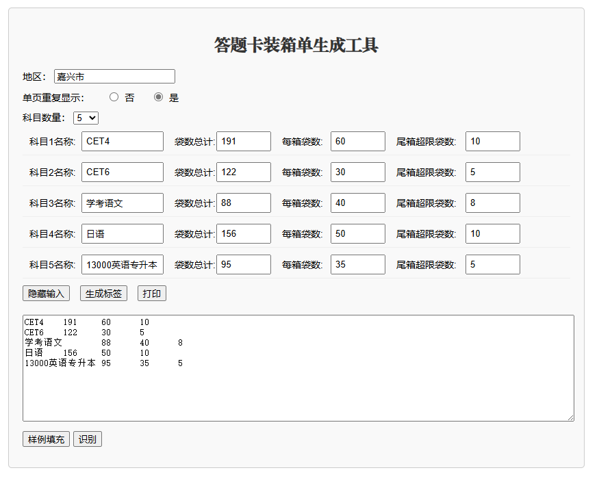
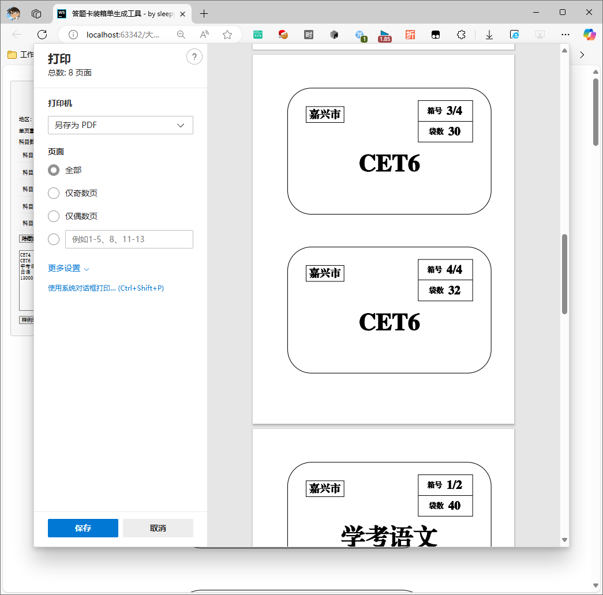

# 答题卡装箱单生成工具

一个用于生成答题卡装箱标签的网页工具。可以根据科目、袋数等信息生成标准化的装箱标签，支持打印。

[Git Page 在线使用[答题卡装箱单生成工具]](https://sleepybear1113.github.io//answer-sheet-box-label/答题卡装箱单生成工具.html)

## 功能特点

- 支持多科目（最多20个）装箱标签生成
- 自动计算箱数和每箱袋数
- 支持尾箱超限设置，可自动合并最后两箱
- 支持单页重复显示（同一标签在一页上显示两次）
- 支持批量数据导入（可从Excel复制数据）
- 标准A4纸张打印支持




## 使用方法

### 基本使用

1. 填写地区名称
2. 选择科目数量
3. 为每个科目填写：
   - 科目名称
   - 袋数总计
   - 每箱袋数
   - 尾箱超限袋数（可选，默认为0）
4. 点击"生成标签"预览
5. 点击"打印"进行打印

### 批量导入

1. 点击"手动输入"显示文本输入框
2. 可以直接在文本框中输入数据，或从Excel复制数据
3. 数据格式：每行一个科目，用空格或Tab分隔   ```
   科目名称 袋数总计 每箱袋数 尾箱超限袋数   ```
4. 点击"识别"自动填充表单
5. 也可以点击"样例填充"查看标准数据格式

### 装箱规则

- 如果总袋数小于等于每箱袋数，直接放一箱
- 否则先按每箱袋数进行分配
- 对于最后一箱：
  - 如果最后一箱和倒数第二箱的总数 ≤ 每箱袋数+最大超限袋数，则合并为一箱
  - 否则保持分开

例如：
- 总数191袋，每箱60袋，超限10袋
- 正常会分为：60,60,60,11
- 由于11+60=71 > 60+10=70，所以保持4箱

## 打印说明

- 使用A4纸张
- 每页显示两个标签（上下布局）
- 可选择是否在同一页重复显示相同标签
- 标签内容包括：地区、箱号、袋数、科目名称
